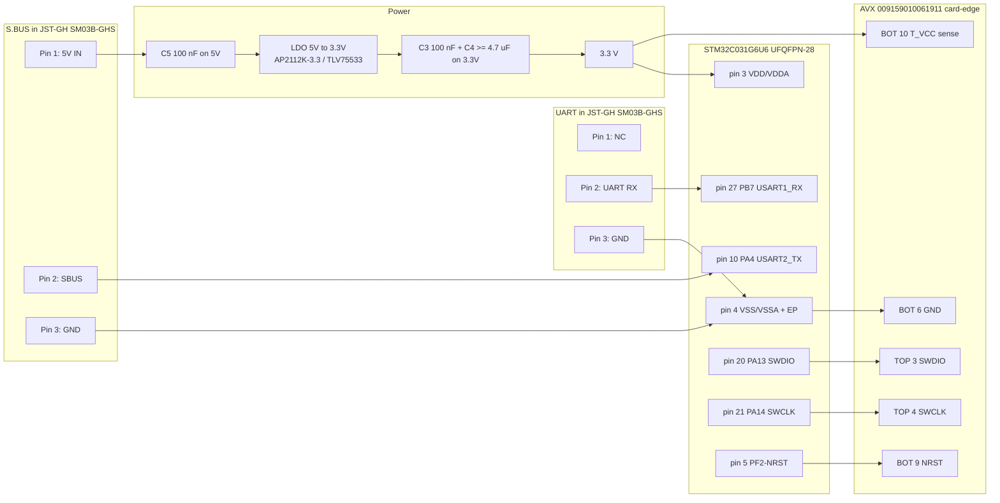

# Finwood UART-S.BUS STM32C031G6U6 (`sbus_c031g6`)

Intended hardware for `samples/uart_sbus`: a cut-through UART (115200 8N1)
to inverted S.BUS (100 kbit/s 8E2) converter on **STM32C031G6U6**
(UFQFPN-28, 32 KB Flash, 12 KB RAM, Cortex-M0+).

The MCU has only two USARTs. Both are used by the converter, so there is
**no ST-Link VCP UART**. Console is **SEGGER RTT** over SWD.

## MCU package pinout (DS13866 / DS13867)

STM32C031G6U6, UFQFPN-28 (4 × 4 mm). Pin numbers below are package pins
from Table 12 (UFQFPN28 column) and Figure 4 of ST DS13866/DS13867.

On this package **VDD and VDDA share pin 3**; **VSS and VSSA share pin 4**.
There is no separate analog supply pin. `VREF+` is internally tied to VDD.

| Pin | Name | Board use |
| ---: | --- | --- |
| 1 | PC14-OSCX_IN | NC (no LSE/HSE crystal) |
| 2 | PC15-OSCX_OUT | NC |
| 3 | VDD/VDDA | 3.3 V from LDO |
| 4 | VSS/VSSA | GND |
| 5 | PF2-NRST | debug T_NRST; internal pull-up |
| 6 | PA0 | NC |
| 7 | PA1 | NC |
| 8 | PA2 | NC (do not steal for USART2_TX; keeps SWD simpler) |
| 9 | PA3 | NC |
| 10 | **PA4** | **S.BUS out** USART2_TX (AF1), inverted |
| 11 | PA5 | NC |
| 12 | PA6 | NC |
| 13 | PA7 | NC |
| 14 | PB0 | NC |
| 15 | PB1 | NC |
| 16 | PA8 | NC (do not mux USART1_RX here) |
| 17 | PC6 | NC |
| 18 | PA11 [PA9] | NC |
| 19 | PA12 [PA10] | NC |
| 20 | **PA13** | **SWDIO** |
| 21 | **PA14-BOOT0** | **SWCLK**; BOOT0 unstrapped (option bytes / SWD) |
| 22 | PA15 | NC |
| 23 | PB3 | NC |
| 24 | PB4 | NC |
| 25 | PB5 | NC (WKUP6 on C031Gx; unused) |
| 26 | PB6 | NC |
| 27 | **PB7** | **UART in** USART1_RX (AF0) |
| 28 | PB8 | NC |
| EP | exposed pad | GND (tie to VSS) |

PA4 is also WKUP2 on STM32C031Gx. This board does not enable `&pwr`
wakeup nodes, so there is no conflict with S.BUS TX.

C031 GPIOs are 5 V-tolerant. S.BUS TX is still **3.3 V** (normal for S.BUS).

## Circuit

Power comes from the **S.BUS JST-GH 5 V**, not from ST-Link. STM32C031 VDD
is 2.0–3.6 V, **not 5 V**. A 5 V → 3.3 V LDO is required.

STLINK-V3MINIE **does not power the target**. CN2 T_VCC is **voltage sense
only**. Target 3.3 V must be up before connecting debug.



### ASCII netlist

```
S.BUS GH Pin1 (5V) ----+---- C5 100nF to GND
                       |
                       +---- LDO VIN  (AP2112K-3.3 / TLV75533, EN=VIN if present)
                                    |
                                    +-- LDO VOUT = 3V3
                                         |
                                         +-- C3 100nF to GND (at MCU pin 3)
                                         +-- C4 >=4.7uF to GND
                                         +-- MCU pin 3 VDD/VDDA
                                         +-- card-edge BOT10 T_VCC (sense only)

S.BUS GH Pin2 (signal) ---- MCU pin 10 PA4  USART2_TX inverted 100000 8E2
S.BUS GH Pin3 (GND)    ---- GND / MCU pin 4 VSS/VSSA / EP

UART GH Pin1 (NC)      ---- no net (do not feed companion 5V into the board)
UART GH Pin2 (RX)      ---- MCU pin 27 PB7  USART1_RX 115200 8N1
UART GH Pin3 (GND)     ---- GND

Card-edge TOP1 Reserved ---- NC
Card-edge TOP2 T_JTDI   ---- NC
Card-edge TOP3 T_SWDIO  ---- MCU pin 20 PA13
Card-edge TOP4 T_SWCLK  ---- MCU pin 21 PA14-BOOT0
Card-edge TOP5 T_SWO    ---- NC (M0+ has no SWO/ITM)
Card-edge BOT6 GND      ---- GND
Card-edge BOT7 T_VCP_RX ---- NC (no spare USART)
Card-edge BOT8 T_VCP_TX ---- NC
Card-edge BOT9 T_NRST   ---- MCU pin 5 PF2-NRST
Card-edge BOT10 T_VCC   ---- 3V3 sense from LDO output
```

## Connectors

### Input — horizontal 3-pin JST-GH

Side-entry **SM03B-GHS-TB** (or BM03B-GHS / equivalent, 1.25 mm pitch).

Pinout **matches the S.BUS connector convention**, except pin 1 is NC so a
companion 5 V rail cannot back-feed the board. Board power is S.BUS 5 V only.

| Pin | Net | Notes |
| ---: | --- | --- |
| 1 | NC | Do not connect companion 5 V |
| 2 | UART RX | to MCU **PB7** pin 27, USART1_RX, 115200 8N1 |
| 3 | GND | |

### S.BUS out — horizontal 3-pin JST-GH

Same series (SM03B-GHS-TB). This is the **power inlet**.

| Pin | Net | Notes |
| ---: | --- | --- |
| 1 | **5V IN** | from flight-controller S.BUS port → LDO |
| 2 | **sbus-out** | USART2 TX inverted on **PA4** pin 10, 3.3 V, idle low |
| 3 | GND | |

No external inverter. Hardware `tx-invert` in the board DTS.

### Debug — ST-Link V3E / V3MINIE CN2 card-edge

Mate with STLINK-V3MINIE **CN2**. Connector: **AVX 009159010061911**
(10-position, 2.0 mm card-edge). Mapping follows ST UM2910 Table 3:

| Side | Pin | Signal | Board net |
| --- | ---: | --- | --- |
| TOP | 1 | Reserved | NC — do not connect |
| TOP | 2 | T_JTDI | NC (SWD only) |
| TOP | 3 | T_SWDIO / JTMS | PA13 pin 20 |
| TOP | 4 | T_SWCLK / JTCK | PA14 pin 21 |
| TOP | 5 | T_SWO / JTDO | NC (M0+ has no SWO/ITM) |
| BOT | 6 | GND | GND |
| BOT | 7 | T_VCP_RX (ST-Link → MCU RX) | NC (both USARTs used by converter) |
| BOT | 8 | T_VCP_TX (MCU TX → ST-Link) | NC |
| BOT | 9 | T_NRST | PF2-NRST pin 5 |
| BOT | 10 | T_VCC | 3.3 V sense from LDO output |

VCP UART is unused. Console is RTT via OpenOCD / probe-rs
(`west rtt -r openocd`) or pyOCD. Black Magic Probe only if firmware has RTT.

## Power details

- LDO: **AP2112K-3.3**, **TLV75533**, or similar SOT-23-5, 5 V in, 3.3 V out.
  Cin/Cout per datasheet. Tie EN high / to VIN if the part has an enable pin.
- Decoupling: **100 nF + ≥ 4.7 µF** on 3.3 V **close to MCU pin 3 / pin 4**.
  **100 nF** on 5 V in at the S.BUS connector.
- UFQFPN-28 has a combined **VDD/VDDA** pin; one 100 nF at pin 3 covers both.
- PF2-NRST has an **embedded weak pull-up** (DS13866 pin type RST). An
  extra 10 kΩ to 3.3 V is optional, not required for the internal POR to work.

## Short BOM

| Qty | Ref | Part |
| ---: | --- | --- |
| 1 | U1 | STM32C031G6U6, UFQFPN-28 |
| 1 | U2 | 5 V → 3.3 V LDO, SOT-23-5 (AP2112K-3.3 or TLV75533) |
| 2 | J1, J2 | JST-GH 3-pin side-entry SM03B-GHS-TB (1.25 mm) |
| 1 | J3 | AVX 009159010061911 10-pos 2.0 mm card-edge |
| 1 | C1 | 100 nF, 5 V in |
| 1 | C2 | LDO Cin per datasheet |
| 1 | C3 | 100 nF, 3.3 V at MCU VDD/VDDA pin 3 |
| 1 | C4 | ≥ 4.7 µF, 3.3 V |
| 1 | C6 | LDO Cout per datasheet |
| 1 | R1 | 10 kΩ NRST pull-up (optional; PF2 has internal pull-up) |

## Zephyr mapping

| Alias | Peripheral | Pin | Package pin | Config |
| --- | --- | --- | ---: | --- |
| `uart-in` | USART1 RX | PB7 | 27 | 115200 8N1, RX-only, FIFO, IRQ 27 prio 0 |
| `sbus-out` | USART2 TX | PA4 | 10 | 100000 8E2, `tx-invert`, TX-only, FIFO, IRQ 28 prio 1 |

SYSCLK is **HSI 48 MHz** (no HSE crystal). USART1 preempts USART2.

## Build and flash

RTT console needs the Zephyr `segger` module (`west.yml` imports it). From
the `zephyr-devel` workspace root, after `west update` has fetched
`deps/modules/debug/segger`:

```
export ZEPHYR_BASE=$PWD/deps/zephyr
export ZEPHYR_SDK_INSTALL_DIR=/opt/
export ZEPHYR_TOOLCHAIN_VARIANT=zephyr
uv run west build -b sbus_c031g6 -d /tmp/b_sbus_c031g6 samples/uart_sbus
uv run west flash -d /tmp/b_sbus_c031g6
```

If west does not see this module’s `boards/` (for example a git worktree
whose `deps/` symlink makes CMake discover another workspace), add:

```
uv run west build -b sbus_c031g6 -d /tmp/b_sbus_c031g6 samples/uart_sbus -- \
  -DBOARD_ROOT=$PWD -DZEPHYR_EXTRA_MODULES=$PWD
```

and, if `CONFIG_HAS_SEGGER_RTT` stays `n`, also append
`;$PWD/deps/modules/debug/segger` to `ZEPHYR_EXTRA_MODULES`.

Stats `printk` goes to RTT, not UART.
