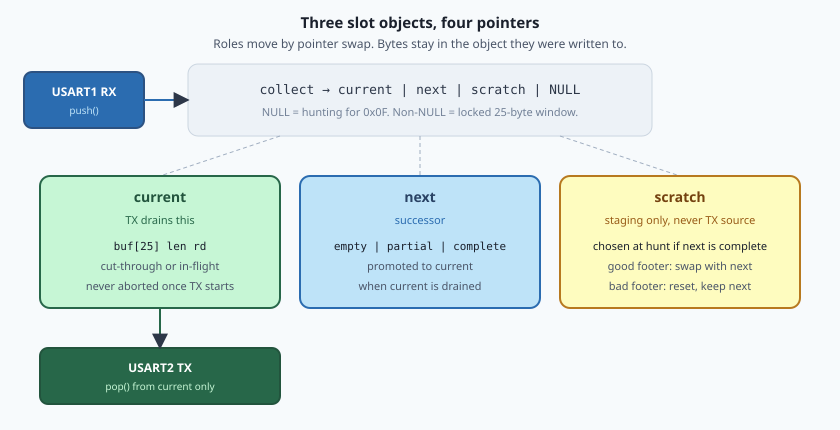
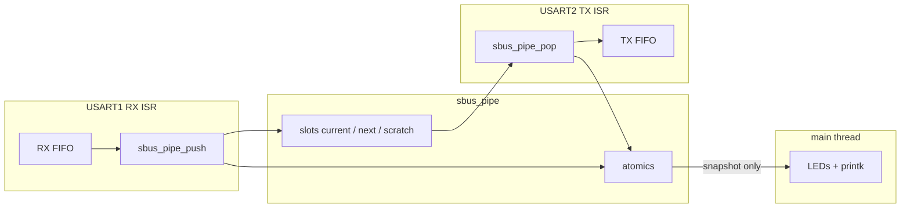
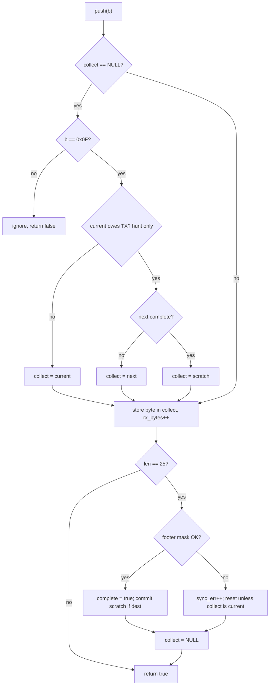
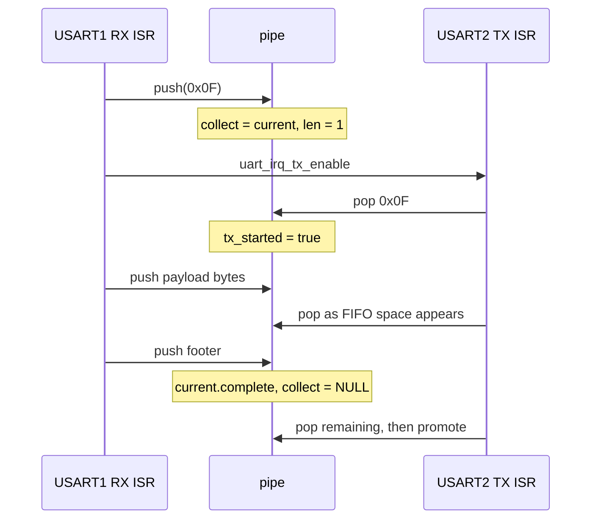
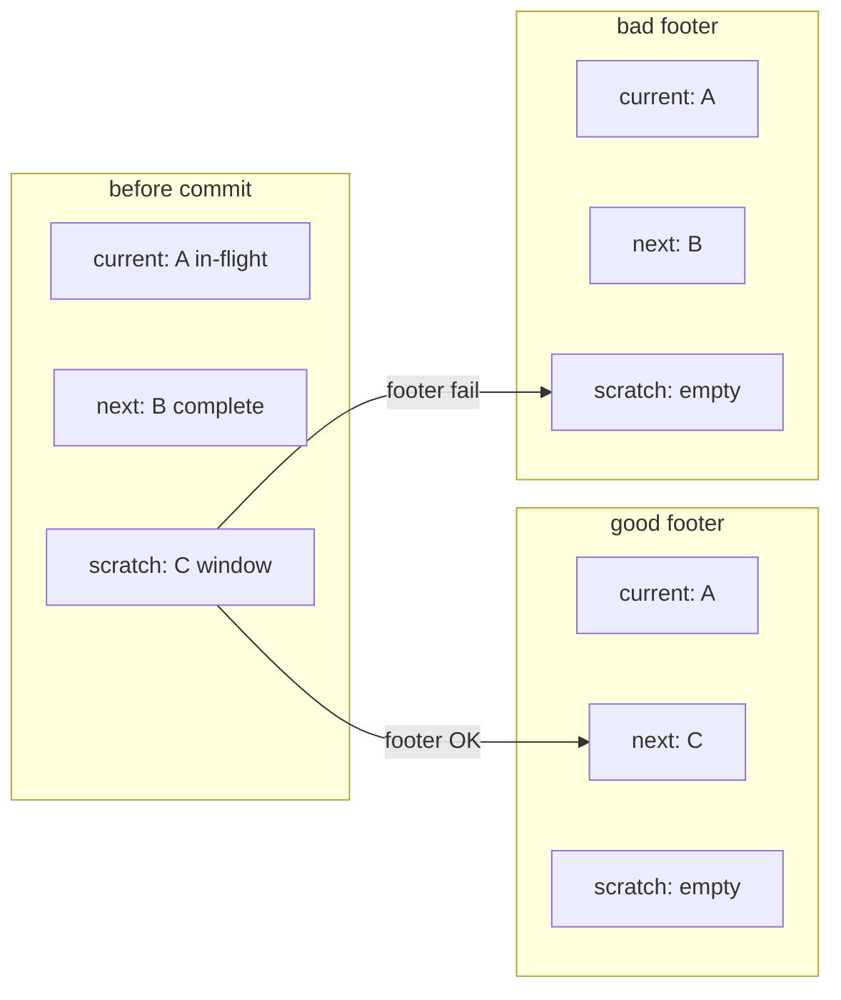

# Triple-buffered S.BUS pipeline

The sample is a **cut-through frame converter**: 115200 8N1 UART in, inverted
100 kbit/s 8E2 S.BUS out. TX starts on the header byte, not the footer.

Capacity is **two frames** that TX may send: `current` (in-flight or
cut-through) plus at most one waiting complete `next`. `next` can also be a
**partial** live window while RX is filling it. The third slot (`scratch`) is
not a third TX queue; it is staging so a candidate replacement can finish its
footer check without destroying a complete waiting frame.

**`current` owes TX** means USART2 is not finished with that slot: it still
has unread bytes, TX has already started on it, or it holds a complete frame
waiting to drain. A new header then cannot cut through into `current`; it
goes to `next` or `scratch` instead. An idle empty `current` owes nothing,
so the header is stored there and TX can start on byte 0.

Wiring, LEDs, and build steps live in [README.rst](README.rst). The assembler
is [`sbus_pipe.c`](src/sbus_pipe.c) / [`sbus_pipe.h`](src/sbus_pipe.h); IRQ
glue is [`main.c`](src/main.c).



---

## S.BUS in brief

Classic Futaba S.BUS is a 25-byte serial frame. On the wire it is **100000
baud, 8E2, inverted** (idle low). This sample does not unpack channels; it
only recognizes the frame envelope and forwards bytes.

```text
 byte     0   1 ............... 22    23     24
        +----+--------------------+--------+----+
        |0x0F|  16 x 11-bit CH    | flags  | FTR|
        +----+--------------------+--------+----+
         HDR   packed payload      ch17/18  0x00
                                   lost/fail
```

| Field | Value | Role in this pipe |
| --- | --- | --- |
| Header | `0x0F` | Starts a locked 25-byte collect window |
| Payload | 22 bytes + flags | Opaque. Interior `0x0F` is **not** a resync |
| Footer | any 25th byte | Valid iff `(footer & SBUS_FOOTER_MASK) == 0x00` |
| Classic mask | `0xFF` (default) | Only footer `0x00` |
| S.BUS2 mask | `0xCB` if `CONFIG_UART_SBUS_SBUS2=y` | Ignores Futaba slot bits 2, 4, and 5 (so `0x04` / `0x14` / `0x24` / `0x34` pass, and so does e.g. `0x10`) |
| Gap bytes | telemetry / noise | Dropped while hunting; they do **not** increment `sync_err` |

A header is hunted only when no window is open. After `0x0F`, the next 24
bytes are payload even if one of them is `0x0F`.

PHY conversion is the glue's job, not the assembler's: USART1 RX is 115200
8N1; USART2 TX is 100000 8E2 with hardware `tx-invert`.

---

## Who writes, who reads



| Actor | Writes | Reads |
| --- | --- | --- |
| USART1 RX ISR | `push` into `collect`'s slot; `rx_bytes`, `rx_frames`, `sync_err`, `supersede`; `rx_err` from `uart_err_check` (glue) | UART byte; slot roles to pick `collect`; after `push`, `collect == NULL` means the window ended and the ISR `k_sem_give`s |
| USART2 TX ISR | `pop` from `current` (`rd`, `tx_started`); `tx_bytes`, `tx_frames`; promote swap; `k_sem_give` | `current->buf` |
| Main | GPIO / console only | atomics only |

Main never touches slot pointers or buffers. The byte path is ISR-only.

---

## Slots

Three **objects** live in `slots[3]`. Four **pointers** name their jobs:

| Pointer | Job |
| --- | --- |
| `current` | TX source. Cut-through partial, in-flight, or idle empty |
| `next` | Successor: empty, a partial collect, or one complete waiting frame |
| `scratch` | Staging. Chosen as `collect` at hunt iff `next` is already complete. May stay `collect` after promote has emptied `next`. Never a TX source |
| `collect` | Live window destination, or `NULL` while hunting |

`collect` is not a fourth buffer. It aliases `current`, `next`, or `scratch`
for the open window.

Roles move by **pointer swap**. A completed scratch is swapped with `next`; a
drained `current` is swapped with `next`. Bytes are never `memcpy`'d between
slots.

```text
init:     current -> slots[0]    next -> slots[1]    scratch -> slots[2]
promote:  swap current <-> next, then reset the new next
commit:   swap next <-> scratch, then reset the new scratch
          (only when the window was collected into scratch)
```

Each slot carries its own write/read cursor:

| Field | Meaning |
| --- | --- |
| `buf[25]` | Frame bytes |
| `len` | Valid count (RX write index / bytes owed to TX) |
| `rd` | TX read index |
| `complete` | `len == 25` and footer passed the mask |
| `tx_started` | At least one byte given to the USART FIFO |

So `current` **owes TX** when `complete || tx_started || (rd < len)`: there
is something left for `pop`. That is the hunt-time test that steers a new
header away from cut-through.

At hunt, `next` is empty or complete. A partial `next` exists only while
`collect == next`.

---

## Assembler

Hunt vs collect is a single nullable pointer: **`collect == NULL` means
hunt**. The dest choice below runs only on a header that opens a window.



Hunt noise does not increment `sync_err`. Committing scratch swaps it with
`next` and increments `supersede` if `next` was still complete.

Rules that matter in the field:

1. **Locked window.** After a header, 24 more bytes are taken even if one is
   `0x0F`.
2. **Footer is known only at byte 25.** Cut-through may already have put a
   bad frame on the wire. Remaining `current` bytes still go out; then the
   slot is drained and promoted so the pipe cannot stall.
3. **Bad footer on `next` or `scratch`.** Reset that slot. A complete waiting
   `next` is untouched (the bad window lived in `scratch`).
4. **Good footer on `scratch`.** Swap into `next`. If `next` was already
   complete, that is superseded.

---

## Cut-through

When `current` owes no TX, the header is stored in `current`. USART2 can
start shifting **before** the footer exists. The RX ISR enables the TX IRQ
on every successful `push` (not only on the header).



Between RX bytes, `rd == len` can be true while the window is still open.
That is a TX gap, not a drained slot. Promote is blocked while
`collect == current`.

If the footer then fails, remaining `current` bytes still `pop` onto the
wire. `tx_frames` does **not** increment (only a complete drain counts).
When `rd` catches `len`, promote still happens so `next` can become
`current`.

---

## Supersede

RC data goes stale. A complete frame sitting in `next` that has **not**
started TX is dropped as a whole when a newer **valid** frame commits.

That is why `scratch` exists. Footer validity is unknown until byte 25. If
`next` already holds a good waiting frame, the new window cannot be written
into `next->buf` or a bad footer would destroy it.

```text
current  [ A : TX started            ]
next     [ B : complete, waiting     ]
scratch  [ C : collecting...         ]

C good footer:
  swap next <-> scratch, reset scratch
  next = C,  B discarded,  supersede++

C bad footer:
  reset scratch
  next still B,  supersede unchanged
```



Supersede increments **only** on that commit path, and only if `next` was
complete at swap time. If TX promotes `B` to `current` while `C` is still
collecting, `next` is the reset drained slot (empty). Finishing `C` then
swaps into empty `next` with **no** supersede: `B` is already on the air,
not waiting. `scratch` was chosen because `next` was complete at hunt; it
can remain `collect` after that promote.

Promote itself never supersedes. It only swaps `current` <-> `next` and
resets the drained object. `collect` still points at the same slot object,
which may now be named `current` (partial successor) or still `scratch`
(replacement window).

```text
mid-collect, next empty (partial successor in next):

  drain current  ->  swap  ->  that partial is now current
  collect already pointed at it; cut-through continues, no copy

mid-collect, next complete (window in scratch):

  drain current  ->  complete next becomes current
  scratch keeps the in-progress window
```

---

## Concurrency

USART1 and USART2 are **equal NVIC priority** (`BUILD_ASSERT` in
`main.c`). On Cortex-M they do not nest: one ISR runs to completion, then
the other may tail-chain.

So `push` and `pop` never overlap. There is no `irq_lock` around the pointer
swaps. The invariant is the shared priority, not a critical section.

Tail-chaining still happens in program order:

- After RX returns, TX may `pop` `current` until `rd == len`. If
  `collect == current`, that is a cut-through gap and must **not** promote,
  or the rest of the window would land in the wrong role.
- After TX returns, RX may `push` into `next` or `scratch`. Those are
  different objects from `current`.
- A `scratch` <-> `next` swap never touches `current`, so it cannot abort
  in-flight TX.
- If those IRQs were ever split in priority, both swaps would need a lock
  again: they both mutate `next`.

USART1's RX FIFO covers incoming bytes for the duration of a same-priority
TX ISR. Console (LPUART1) stays at a lower priority and is not on the S.BUS
path.

Unit tests on `native_sim` call `push` / `pop` from one thread in program
order; they do not model ISR tail-chaining.

---

## Counters

| Atomic | Incremented when |
| --- | --- |
| `rx_bytes` | Every accepted collect byte, including the header |
| `tx_bytes` | Every successful `pop` |
| `rx_frames` | Good footer at the end of a window |
| `tx_frames` | `current` drained **and** `complete`. Console `fps` is this delta over elapsed whole seconds in the 1 s stats period. Green pulses when `tx_frames / 10` changes, not once per frame |
| `supersede` | Complete waiting `next` replaced by a newer valid scratch |
| `sync_err` | Bad footer at byte 25 |
| `rx_err` | UART hardware error in the RX ISR (glue, not the assembler) |
