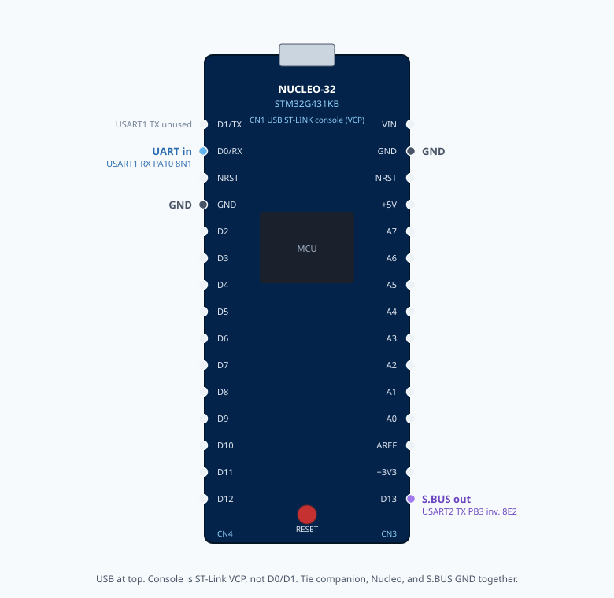

UART to S.BUS converter
#######################

Cut-through converter: bytes arriving on ordinary 115200 8N1 UART are
emitted on an inverted 100 kbit/s 8E2 S.BUS UART. The sample does not
parse S.BUS frames. Transmission starts on the first input byte.

Supported board: ``nucleo_g431kb``.

Wiring (Nucleo-32 Arduino Nano header)
**************************************

   Nucleo-32 pinout (USB / ST-LINK at the top). Count down the left header (CN4):
   D3 is the 6th pin (S.BUS out), D7 is the 10th pin (UART in), GND is the 4th.

- Console (ST-Link VCP): LPUART1 PA2/PA3 (D1/D0), 115200 8N1
- Input: USART1 RX **PB7 (D7)**, 115200 8N1
- S.BUS output: USART2 TX **PB3 (D3)**, 100000 8E2, hardware ``tx-invert``,
  TX-only. Idle is low. No external inverter.
- Tie companion UART, Nucleo, and S.BUS device **GND** together.

Building and flashing
*********************

.. code-block:: console

   export ZEPHYR_BASE=$PWD/deps/zephyr
   uv run west build -b nucleo_g431kb -d /tmp/b_uart_sbus samples/uart_sbus
   uv run west flash -d /tmp/b_uart_sbus

Stats
*****

Every 10 seconds the console prints lifetime counters and an estimated
frames/s for that interval (``tx_delta / 25 / 10``):

.. code-block:: console

   sbus: rx=25000 tx=25000 drops=0 err=0 fps=100

A dropped byte can desynchronize an S.BUS consumer. If input stops, S.BUS
goes idle; the flight controller must apply its own failsafe.
