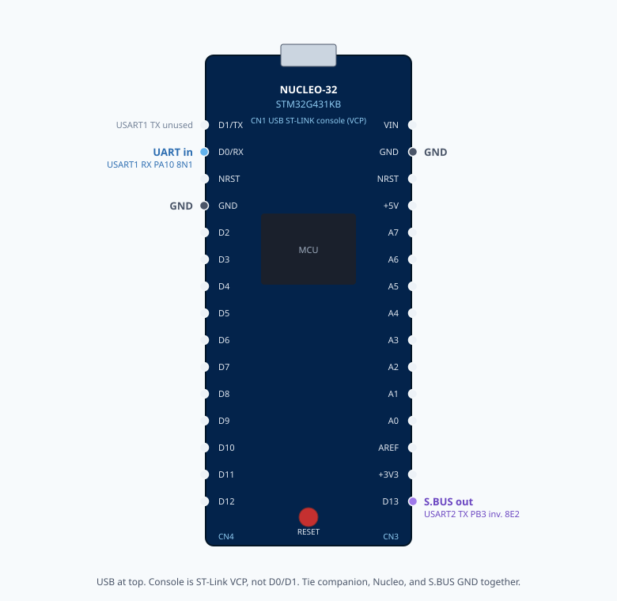

UART to S.BUS converter
#######################

Cut-through converter: classic 25-byte S.BUS frames arriving on ordinary
115200 8N1 UART are emitted on an inverted 100 kbit/s 8E2 S.BUS UART.
Transmission starts on the first header byte (``0x0F``), not after the
footer. A locked 25-byte window follows each header; payload ``0x0F``
does not resync. A complete frame still waiting to start TX is dropped
as a whole when a newer valid frame is committed.

Pipeline internals (slots, cut-through, supersede): `PIPELINE.md <PIPELINE.md>`_.

Supported boards: ``nucleo_g431kb`` and ``sbus_bridge``.

``sbus_bridge`` is the intended custom hardware (STM32C031F6P6 UART→S.BUS
PCB). Console on that board is **SEGGER RTT over SWD**, not a UART.

Robustness
**********

Field builds enable a small recovery package:

- Independent IWDG with a 100 ms window, fed from the main loop (≤5 ms tick).
- Stack sentinel plus reboot-on-fatal so overflow/faults reset instead of hang.
- Terse fault dump (``CONFIG_FAULT_DUMP=1``) and 1 KiB main/ISR stacks.

See ``docs/superpowers/specs/2026-10-06-uart-sbus-field-robustness-design.md``.

Wiring (Nucleo-32 Arduino Nano header)
**************************************

         Red error LED on D12 to 5 V. Console is ST-Link USB, not D0/D1.

   Nucleo-32 pinout (USB / ST-LINK at the top) per ST UM2397. D0/D1 are USART1,
   not the ST-Link VCP. VCP is LPUART1 on PA2/PA3, wired only to the debugger.

- Console: ST-Link VCP (USB serial), LPUART1 PA2/PA3, 115200 8N1. Not Arduino D0/D1.
- Input: USART1 RX **PA10 (Arduino D0, CN4 pin 2)**, 115200 8N1
- S.BUS output: USART2 TX **PB3 (Arduino D13, CN3 pin 15)**, 100000 8E2,
  hardware ``tx-invert``, TX-only. Idle is low. No external inverter.
- Green activity: onboard **LD2 (PB8)**, 50 ms pulse every 10 transmitted frames
- Red error: external LED on **D12 / PB4 (CN4 pin 15)**, GPIO open-drain
  active-low. Wire **+5 V (CN3 pin 4)** → ~330 Ω → LED anode → cathode to D12.
  200 ms on supersede, 2 s on UART/sync faults (not sticky; retrigger uses max
  remaining vs new duration).
- Tie companion UART, Nucleo, and S.BUS device **GND** together.
- Do not use D7 or D3: D7 is PF0 (OSC_IN) and D3 is PB0. Neither is a USART pin.
- Do not use A7 for the LED. A7 is PA2 (LPUART1 TX / ST-Link VCP) and is not
  5 V-tolerant.

Wiring (``sbus_bridge``, STM32C031F6P6 TSSOP-20)
************************************************

- Console: SEGGER RTT via SWD (no spare USART for ST-Link VCP)
- UART: USART1 TX **PA0**, RX **PA1** (internal pull-up), 115200 8N1
- S.BUS: USART2 TX inverted **PA4**, 100000 8E2, hardware ``tx-invert``,
  idle low. No external inverter.
- Green activity: **PA6**, push-pull active-high (``led0``)
- Red error: **PA7**, push-pull active-high (``led1``)
- Debug: SWDIO **PA13**, SWCLK **PA14**, NRST **PF2**

See ``boards/starcopter/sbus_bridge/README.md`` for the pin map and flash
runners.

Building and flashing
*********************

Nucleo-G431KB::

   export ZEPHYR_BASE=$PWD/deps/zephyr
   uv run west build -b nucleo_g431kb -d /tmp/b_uart_sbus samples/uart_sbus
   uv run west flash -d /tmp/b_uart_sbus --runner openocd

Optional Futaba S.BUS2 slot footers (``0x04`` / ``0x14`` / ``0x24`` / ``0x34``)::

   uv run west build -b nucleo_g431kb -d /tmp/b_uart_sbus samples/uart_sbus -- -DCONFIG_UART_SBUS_SBUS2=y

Default is classic S.BUS only (footer ``0x00``). Inter-window telemetry bytes
are always dropped while hunting; they do not increment ``sync``.

``sbus_bridge``::

   export ZEPHYR_BASE=$PWD/deps/zephyr
   export ZEPHYR_SDK_INSTALL_DIR=/opt/
   export ZEPHYR_TOOLCHAIN_VARIANT=zephyr
   uv run west build -b sbus_bridge -d /tmp/b_sbus_bridge samples/uart_sbus
   uv run west flash -d /tmp/b_sbus_bridge

Stats
*****

Every 1 second the console prints lifetime counters and frames/s for that
interval (``tx_frames`` delta / elapsed whole seconds):

.. code-block:: console

   sbus: rx=25000 tx=25000 err=0 frames=1000 fps=100 sup=0 sync=0

``frames`` is lifetime fully transmitted valid S.BUS frames. ``sup`` is
waiting frames dropped as stale. ``sync`` is bad footers at the end of a
25-byte window. A bad footer after cut-through still emits the bytes already
on the wire; the incomplete ``current`` is drained and promoted. If input
stops, S.BUS goes idle; the flight controller must apply its own failsafe.
