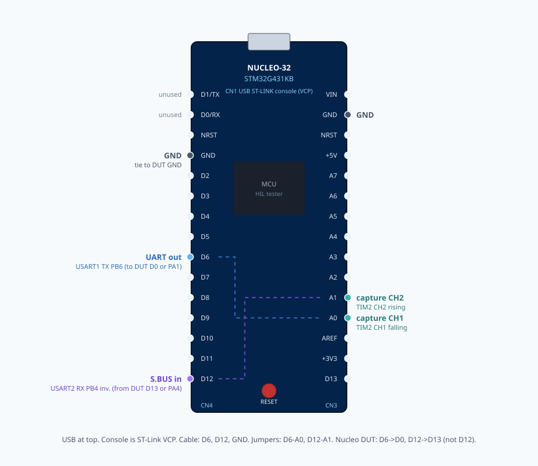

# sbus_bridge hardware-in-the-loop (Nucleo-G431KB)

ZTest fixture that black-box tests a production `samples/uart_sbus` image on
`starcopter/sbus_bridge`. One firmware image runs an EOL suite at boot
(cut-through, 100 Hz paced stream, gapless overload) and exposes a shell
command to repeat the same checks on the line.

Common ground between DUT and tester. Both run at 3.3 V.

## Wiring



| DUT (`sbus_bridge`) | Direction | Tester |
| --- | --- | --- |
| PA1 — USART1 RX, 115200 8N1 | tester → DUT | PB6 — USART1 TX (D6) |
| PA4 — USART2 TX, inverted 100000 8E2 | DUT → tester | PB4 — USART2 RX, `rx-invert` (D12) |

DUT PA0 (USART1 TX) stays open. Common GND. 3.3 V.

On the tester, jumper **D6↔A0** and **D12↔A1** so TIM2 can input-capture the
same edges (CH1 falling on UART start, CH2 rising on inverted S.BUS start).

Tester console is LPUART1 (PA2/PA3) via the Nucleo’s ST-Link VCP.

Round-trip capture is used on the cut-through frame and on each paced frame.
It is **not** measured during the gapless case (overlapping start bits).

## Flash

From the `zephyr-devel` west workspace root, with `ZEPHYR_BASE` pointing at
`deps/zephyr`:

**DUT** — production image (flash once before powering the tester):

```bash
uv run west build -b sbus_bridge -d /tmp/b_sbus_bridge samples/uart_sbus
uv run west flash -d /tmp/b_sbus_bridge
```

Use the default classic footer (`CONFIG_UART_SBUS_SBUS2` off).

**Tester** — this directory:

```bash
uv run west build -b nucleo_g431kb -d /tmp/b_sbus_hil tests/sbus_bridge_hil
uv run west flash -d /tmp/b_sbus_hil
```

## Console

Open the tester’s ST-Link serial port at **115200 8N1**. On boot, ZTest runs
suite `eol` automatically and prints `PROJECT EXECUTION SUCCESSFUL` or
`PROJECT EXECUTION FAILED` (fail-fast stops at the first failing case).

To re-run the suite without rebooting, type:

```text
eol
```

The shell prints `eol: PASS` or `eol: FAIL`. ZTest does not repeat the
`PROJECT EXECUTION …` line on shell re-runs; use the `eol:` line as the
factory retest verdict.
